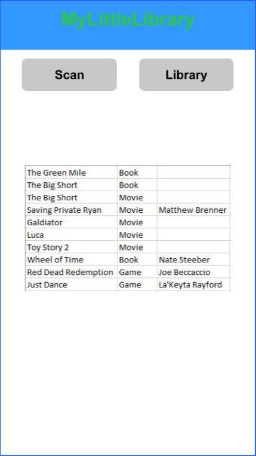
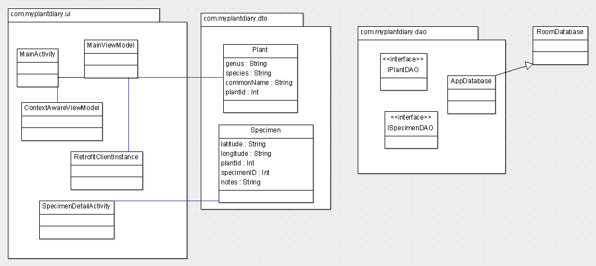

**Design Document**

Danae Brenner

**Introduction**

Have you ever lent a movie/game/book to someone and then completely forgotten who you lent it to? Do you want to keep a list of all of the movies or books or games that you own on your phone? MyLittleLibrary can help you:

- Record dates and records of what you have lent to people
- Keep track of the items that you have loaned out
- Remind you of items that still haven’t been returned to you.

Use your device to create an inventory of all of your items or just use this application to track the movies, books, games that you have let your friends and family borrow. Use your Android device to create your own plant diary. Scan the barcodes with the on-device camera or manually enter the UPC/ISBN numbers. Create reminders based on when an item should be returned to you. Receive alerts about items that haven’t been returned yet.

**Storyboard**

[MyLittleLibrary Storyboard](https://projects.invisionapp.com/prototype/ckyz8b84r0006z501gl7fg4wv/play)

**Functional Requirements**

**Requirement 100.0: Add an Item to your Library**

**Scenario**

As a user, I want to be able to add an item to my Library by scanning it or manually entering it.

**Dependencies**

UPC/ISBM data will need to be available and accessible.

The device has a camera, and the user has granted access to the camera.

**Assumptions**

ISBN numbers for books.

UPC data for books, games, and movies.

**Examples**

1.1
**Given** I have a copy of The Green Mile by Stephen King

**When** I scan the barcode 

**Then** I should receive a success screen that it has been added to MyLibrary 

1.2
**Given** I have a copy of The Green Mile by Stephen King

**When** I manually enter the ISBN “1501192264”

**Then** I should be able to enter it into MyLibrary

1.3
**Given** I have a copy of The Green Mile by Stephen King that has already been added to MyLibrary

**When** I scan the barcode or manually enter the ISBN “1501192264”

**Then** I should receive a message that this item is already in MyLibrary

1.3
**Given** I have lent The Green Mile by Stephen King to a friend

**When** they return it to me

**Then** I should be able to “check” it back into MyLibrary 

1.4
**Given** I have a entered my books/movies/games into MyLittleLibrary

**When** I search MyLibrary

**Then** I should be able to see the items that I own and what has been lent out

**Requirement 101: Lend an Item out of MyLibrary**

**Scenario**

As a user with items stored in MyLittleLibrary, I want to be able to lend items out of MyLibrary.

**Dependencies**

Movie/Book/Game data is stored, available and accessible.

Device could have access to your contact list.

**Assumptions**

ISBN numbers for books.

UPC data for books, games, and movies.

**Examples**

1.1
**Given** I have a friend who wants to borrow The Green Mile by Stephen King

**When** I scan the barcode and select “check-out”

**Then** I should enter the name of my friend and receive a “Success” screen.

**Requirement 101: Return an Item to MyLibrary**

**Scenario**

As a user of MyLittleLibrary, I want to be able to return items to MyLibrary.

**Dependencies**

Movie/Book/Game data is stored, available and accessible.

Device could have access to your contact list.

**Assumptions**

ISBN numbers for books.

UPC data for books, games, and movies.

**Examples**

1.1
**Given** I have a friend who wants to return The Green Mile by Stephen King

**When** I scan the barcode and select “check-in”

**Then** I should receive a “Success” screen.

**Requirement 101: Search MyLibrary**

**Scenario**

As a user with items stored in MyLittleLibrary, I want to be see what all I have entered into the application, what is checked out and what isn’t.

**Dependencies**

Movie/Book/Game data is stored, available and accessible.

Device could have access to your contact list.

**Assumptions**

ISBN numbers for books.

UPC data for books, games, and movies.

**Examples**

1.1
**Given** I have entered items into MyLittleLibrary

**When** I select to “View Library” and select the tab for either Movie/Game/Book

**Then** I should see a list of all of the items that I have entered alphabetically in each category with a “checked out” mark if they have been lent to someone.

**Class Diagram**

**Class Diagram Description**

**MainActivity:** The first screen the user sees. This will have a list of specimens, and an option to enter a new specimen.

**SpecimenDetailsActivity:** A screen that shows details of a specimen.

**RetrofitInstance:** Boostrap class required for Retrofit.

**Plant:** Noun class that represents a plant.

**Specimen:** Noun class that represents a specimen.

**IPlantDAO:** Interface for Retrofit to find and parse Plant JSON.

**ISpecimenDAO:** Interface for Room to persist Specimen data

**Scrum Roles**

- DevOps/Product Owner/Scrum Master: Mari Danae Brenner
- Frontend Developer: Muhammad Hussain
- Integration Developer: Samba Koita & Andrew Glanz

**Weekly Meeting**

Monday at 11:30 AM. Microsoft Teams Call.

